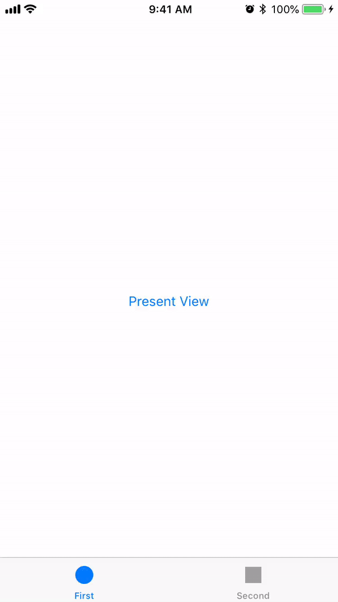

[](muyexi)
[](https://github.com/muyexi/SemiModalViewController/blob/master/LICENSE)

Swift Port of [KNSemiModalViewController](https://github.com/kentnguyen/KNSemiModalViewController), present view / view controller as bottom-half modal.

<p align="center">
  
</p>

## Installation

### CocoaPods

```
pod 'SemiModalViewController'
```

## Usage

Present view controller:

```
let options = [
    SemiModalOptionKey.PushParentBack.rawValue: true
]

let controller = SecondViewController()

controller.view.height = 200
controller.view.backgroundColor = UIColor.redColor()

presentSemiViewController(controller, options: options, completion: {
    print("Completed!")
    }, dismissBlock: {
        print("Dismissed!")
})
```

Or view:

```
let view = UIView(frame: UIScreen.mainScreen().bounds)
view.height = 300
view.backgroundColor = UIColor.redColor()

presentSemiView(view, options: options) {
    print("Completed!")            
}
```

Default options:

```
SemiModalOptionKey.TraverseParentHierarchy.rawValue : true,
SemiModalOptionKey.PushParentBack.rawValue          : false,
SemiModalOptionKey.AnimationDuration.rawValue       : 0.5,
SemiModalOptionKey.ParentAlpha.rawValue             : 0.5,
SemiModalOptionKey.ParentScale.rawValue             : 0.8,
SemiModalOptionKey.ShadowOpacity.rawValue           : 0.5,
SemiModalOptionKey.TransitionStyle.rawValue         : SemiModalTransitionStyle.SlideUp.rawValue,
SemiModalOptionKey.DisableCancel.rawValue           : true
```

## License

SemiModalViewController is released under the MIT license. See LICENSE for details.
